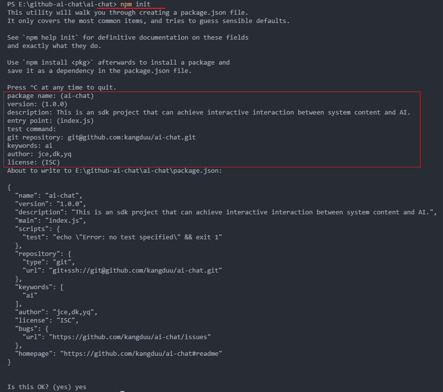

# {{ $frontmatter.title }}

{{ $frontmatter.description }}

## 前提条件
- 项目要求安装`Node.js`最低版本是 10.13.0（LTS）[why](https://webpack.docschina.org/guides/getting-started/)
- 项目建议使用`pnpm`包管理器[why](https://pnpm.io/zh/motivation|https://github.com/GpingFeng/gopal-blog/issues/77)

## 项目准备
1. 创建项目描述文件`package.json`
2. 安装webpack
3. 安装typescript
4. 构建项目目录结构


### 创建package.json

使用 `pnpm init` 命令创建 `package.json` 文件
- [pnpm init](https://docs.npmjs.com/cli/v10/commands/pnpm-init)
- [package.json](https://docs.npmjs.com/creating-a-package-json-file)

运行命令
```bash
pnpm init
```
运行之后会弹出项目描述问题，根据提问一步一步进行，完整之后会在您的项目根目录生成一个`package.json`文件



如果你不想填写这些固定的问题有两种方案：
1. 由于这些问题除了`name`和`version`为必填以外（命令运行就会有默认值，不用手动填写），其余都为非必填，你可以快速按enter键跳过这些问题的回答
2. 使用`pnpm init --yes`或者` init -y`，一键生成带默认值的`package.json`文件

>注意：如果对`pnpm-init on bash`图片上面的具体字段的含义有不清楚的请查阅[package.json](https://docs.npmjs.com/creating-a-package-json-file)文档以了解详细信息

### 安装`webpack`及其相关准备
1. 安装
```bash
pnpm add -D webpack webpack-cli
```
2. 安装`cross-env`
控制`NODE-ENV`的值，实现不同环境运行不同的`webpack`配置的功能
```bash
pnpm add -D cross-env
```
具体用法：[cross-env](https://github.com/kentcdodds/cross-env)

3. 创建webpack配置文件
在根目录下面创建文件夹 **webpack**，在webpack文件夹下创建以下文件夹：
  公共配置：**webpack.config.js**
  开发环境：**webpack.dev.js**
  生产环境：**webpack.prod.js**
>目前只有两个环境，开发环境和生产环境，这个看自己需求可以细分，比如sim、test等等环境

4. 设置环境变量，运行不同配置文件
找到package.json中的"script"属性,在其中添加以下命令:
```json
"scripts": {
  "dev": "cross-env NODE-ENV=development webpack server --config ./webpack/webpack.dev.js",
  "build": "cross-env NODE_ENV=production webpack --config ./webpack/webpack.prod.js",
}
```

5. 使用TypeScript来编写webpack配置
```bash
pnpm add -D typescript ts-node @types/node @types/webpack
```

### 配置`webpack.common.js`
1. 入口文件和出口文件
```javascript
const config = {
  // 上下文路径，配置之后，其他的相对路径都已这个目录路径为基准
  context: path.resolve(__dirname, '您的项目目录'),
  entry: {
    index: {
      import: './index.js'
    },
    output: {
      path:
    }
  }
}
```
2. 加载CSS
```bash
pnpm add -D style-loader css-loader
```
在webpack.common.js中添加以下代码用于处理css文件
```js
 module: {
    rules: [
      {
        test: /\.css$/i,
        use: ["style-loader", "css-loader"],
      },
    ],
  },
```
3. 加载less
```bash
pnpm add -D less less-loader
```
在webpack.common.js中添加以下代码用于处理less文件
```js
 module: {
    rules: [
       {
        test: /\.less$/i,
        use: ["style-loader", "css-loader", 'less-loader'],
      },
    ],
  },
```


### 安装typescript
1. 安装
```bash
pnpm add typescript -D
```
2. 初始化`tsconfig.json`
```bash
tsc --init
```

### 配置babel
```bash
pnpm add -D @babel/core @babel/cli @babel/preset-env
```
在项目根目录创建

### 最终项目结构

```js
·
|-- public
|   |-- index.html
|-- scripts
|   |-- *.(js | ts)
|-- webpack
|   |-- webpack.(ts|js)
|   |-- webpack.?[env].(ts|js)
|-- src
|   |-- assets
|   |   |-- images
|   |   |-- icons
|   |-- Classes
|   |-- components
|   |-- icon
|   |-- theme
|   |-- utils
|   |-- index.(ts?x|js?x)
|   |-- typing.d.ts
|   |-- files.d.ts
|-- demo
|-- docs
|   |-- README.md
|   |-- API.md
|-- test
|-- .babelrc
|-- .editorconfig
|-- .eslintignore
|-- .eslintrc.json
|-- .gitignore
|-- .prettierrc
|-- package.json
|-- tsconfig.json
```


