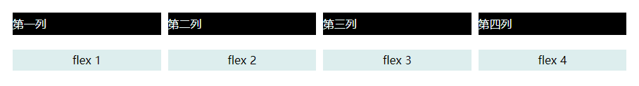
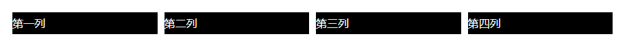

四列等宽布局，间距 10px（考虑浏览器兼容性）



### 🔭 使用浮动实现



- 浮动（清除浮动）
- margin 负值作用（Bootstrap3 栅格容器.container 样式实现）

```css
.container {
  margin-right: -10px; /* 关键 */
}
.row {
  padding-right: 10px; /* 关键 */
  background: #000;
  background-clip: content-box;
  float: left;
  width: 25%;
  line-height: 2em;
  box-sizing: border-box;
  color: azure;
  user-select: none;
}
.container:after,
.container:before {
  display: table;
  content: "";
  clear: both;
}
```

```html
<div class="container">
  <div class="row">第一列</div>
  <div class="row">第二列</div>
  <div class="row">第三列</div>
  <div class="row">第四列</div>
</div>
```

### 🔭 使用 CSS 弹性盒子布局实现


使用[CSS 弹性盒子布局](https://developer.mozilla.org/zh-CN/docs/Web/CSS/CSS_flexible_box_layout)时，应考虑 [gap](https://developer.mozilla.org/zh-CN/docs/Web/CSS/gap) 属性的兼容性问题。

```css
#flex1 {
  width: 100%;
  padding: 0;
  display: flex;
  gap: 10px; /* 低版本浏览器不支持时，舍弃 */
}

.item {
  flex: 1; /* 重点 */
  text-align: center;
  height: 30px;
  line-height: 30px;
  background: #dee;
}
```

```html
<div id="flex1">
  <div class="item">flex 1</div>
  <div class="item">flex 2</div>
  <div class="item">flex 3</div>
  <div class="item">flex 4</div>
</div>
```
