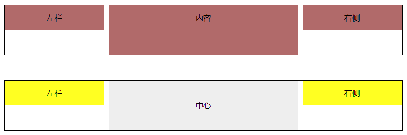
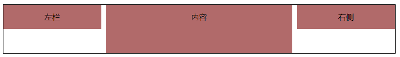
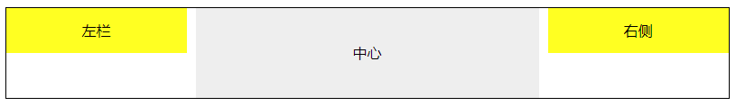

圣杯布局（左右两侧固定宽度，中间自适应宽度）



### 🔭 使用 position 定位



```css
.container {
  width: 800px;
  margin: 50px auto;
  position: relative;
  border: 1px solid #000;
}

.box {
  height: 50px;
  line-height: 50px;
  background: #b16a6a;
  text-align: center;
}

.box.left,
.box.right {
  width: 200px;
  position: absolute;
  top: 0;
}

.box.left {
  left: 0;
}

.box.right {
  right: 0;
}

.box.center {
  margin: 0 210px;
  height: 100px;
}
```

```html
<div class="container">
  <div class="box left">左栏</div>
  <div class="box center">内容</div>
  <div class="box right">右侧</div>
</div>
```

### 🔭 使用 float 浮动，但是 dom 元素位置需要做更改



基本原理是使元素脱离文档流，将内容模块居中。

注意，中心元素必须在最后

```css
.container {
  width: 800px;
  margin: 50px auto;
  position: relative;
  border: 1px solid #000;
}
.center1 {
  margin: 0 210px;
  height: 100px;
  line-height: 100px;
  text-align: center;
  background-color: #eee;
}

.left1,
.right1 {
  width: 200px;
  height: 50px;
  line-height: 50px;
  text-align: center;
  background: #ff2;
}

.left1 {
  float: left;
}

.right1 {
  float: right;
}
```

```html
<div class="container">
  <div class="left1">左栏</div>
  <div class="right1">右侧</div>
  <div class="center1">中心</div>
  <!-- 注意，中心元素必须在最后 -->
</div>
```

### 🔭 使用 margin 负值法

1. 内容块使用元素包裹并触发 BFC，（float：left）
2. 内容块左右外边距大于等于左右两块元素宽度
3. 左右两块设置浮动，并且 margin-left 使用负值
4. 左：margin-left: -100%
5. 右：margin-right：-200px

```css
.wrap {
  width: 100%;
  background-color: transparent;
  float: left;
}
.wrap .center {
  margin: 0 210px;
  height: 200px;
  background-color: #dde;
}
.left,
.right {
  float: left;
  width: 200px;
  height: 100px;
  background: #f19292;
}
.left {
  margin-left: -100%;
}
.right {
  margin-left: -200px;
}
```

```html
<!-- 注意，中心元素必须在最前面，且由wrap包裹，并触发BFC -->
<div class="wrap">
  <div class="center">中心</div>
</div>
<div class="left">左栏</div>
<div class="right">右侧</div>
```

### 🔭 使用 flex 布局

1. content 设置 flex：1

```css
.main {
  display: flex;
  align-items: flex-start;
  justify-content: space-between;
}
.main .center {
  background: #df7979;
  min-height: 200px;
  flex: 1;
}
.main .left,
.main .right {
  width: 200px;
  height: 100px;
  background: #8f6464;
}
```

```html
<main class="main">
  <div class="left">左栏</div>
  <div class="center">中心</div>
  <div class="right">右侧</div>
</main>
```
